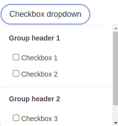

# twig-bulma-form-theme
A Twig 3.x Form Theme for Bulma 0.9.x for use with Symfony 5.x

---

# Twig (3.x) Bulma (v0.9.x) Form theme

Bulma is a modern CSS framework based on Flexbox. This form theme was created for use with the Twig Template engine. Twig is a modern template engine for PHP.

This form theme was built to work with Twig in combination with the Symfony Framework for websites built on top of the Bulma CSS framework.

## Index
* [How to use the form theme](#how-to-use-the-form-theme)
* [Icon support](#icon-support)
* [Examples](#examples)
* [Sources](#sources)

### How to use the form theme:

The easiest way to make use of the form theme in Symfony is to set this form theme in the configuration file. Have a look at the [Symfony documentation](https://symfony.com/doc/current/form/form_customization.html#making-application-wide-customizations). Also example files are provided in this repository.

### Icon support:

The theme also supports the use of icons. Bulma comes with support for the Font Awesome icon toolkit. It's realy easy to make a form widget support these themes with Symfony Form Type Extensions. An example Form Type Extension is provided within the examples directory in this repository.

## Examples

### widget sizes:

Widget size can be set by just using a classname. The following example is for use with the Symfony Form Type.

```php
$builder->add('firstname', TextType::class, [
    'attr' => [
        'class' => 'is-large'
    ],
    ...
]);
```


> **NOTE**
>
> The default size needs no extra class. Suppoted sizes are **is-small**, **is-medium** and **is-large**.

### Icons:

The following example is for use with the Symfony Form Type. This example is based on the Form Type Extension provided in the documentation examples directory.

```php
$builder
    // Username widget with user icon
    ->add('username', TextType::class, [
	    'bulma_icon' => [
            'icon' => 'user',
            'position' => 'left',
        ],
        ...
    ])
    // Password widget with lock icon
    ->add('password', PasswordType::class, [
        'bulma_icon' => [
            'icon' => 'lock',
            'position' => 'left',
        ],
        ...
    ])
;
```


> **Need more icons?**
>
> Have a look at the bulma.io and fontawesome.io website to find out which icons are available and how to implement them.

### Dropdown with ChoiceType:

The following example is for use with the Symfony Form Type 'ChoiceType'

```php
->add('checkbox_dropdown', Type\ChoiceType::class, [
    'choices' => [
        // choice groups are supported (including 'group_by' method)
        'Group header 1' => [
            'Checkbox 1' => 1,
            'Checkbox 2' => 2,
        ],
        'Group header 2' => [
            'Checkbox 3' => 3,
            'Checkbox 4' => 4,
        ],
    ],
    'label' => false, // = don't render top label (trigger button label is always rendered)
    'expanded' => true, // required to use dropdown
    'multiple' => true, // true = checkboxes, false = radio buttons
    'attr' => [
        'dropdown' => true, // required to use dropdown
        'dropdown_arrow_icon' => false, // default to true
        'class' => 'is-rounded is-outlined', // added to dropdown trigger button
    ],
])
```

Render it inside a form:

```html
<!-- easiest way to render -->
{{ form_row(form.checkbox_dropdown) }}

<!-- if you need to customize a little bit -->
<div class="field">
    <!-- remove form_label() if you don't want the top label -->
    <!-- but still a customizable label inside dropdown trigger button -->
    {{ form_label(form.checkbox_dropdown) }}
    <div class="dropdown">
        {{ form_widget(form.checkbox_dropdown) }}
    </div>
</div>
```



## Sources

Have a look at the following websites and their documentation for more information about this subject.

* The [Bulma](http://bulma.io/) CSS framework website;
* The [Font Awesome](http://fontawesome.io/) font and CSS toolkit;
* The [Twig](http://twig.symfony.com/) Template engine for PHP website;
* The [Symfony](http://symfony.com/) PHP framework website.
